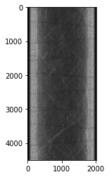
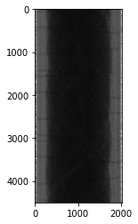
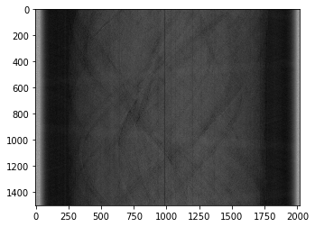
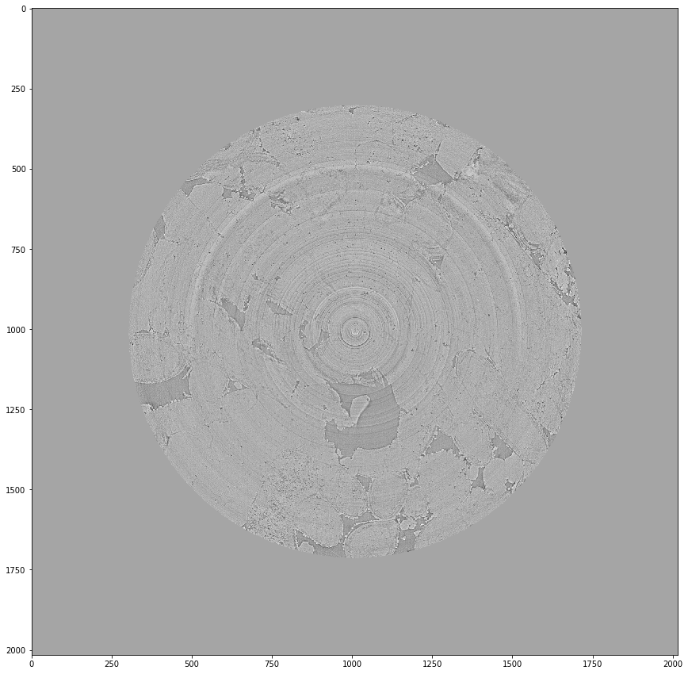
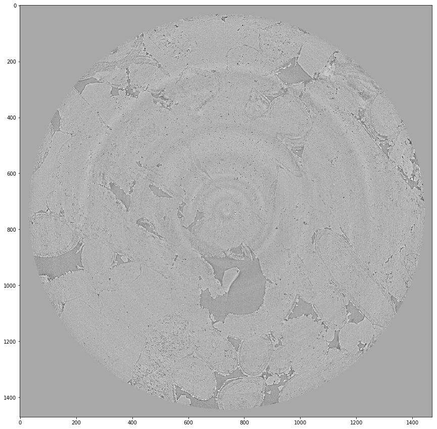

# Tomopy-reconstruction
MicroCT reconstruction using TomoPy
## Reconstructing APS-2BM synchrotron CT data using tomopy

TomoPy API documentation:  https://readthedocs.org/projects/tomopy-test/downloads/pdf/latest/

Synchrotron CT data info:

    Camera=dimax

    static scan - 1501 projs x 4 scans = 6004

    back-forth scan - 601 projs x 20 scans = 12020

    volume size= 1008 x 2016 x 2016

    HDF file structure : exchange/data,data_dark,data_white

    Scan files: projection, flat-field (data_white), dark-field (data_dark)


Construction options: all subfolders, single folder, single hdf, single volume, only multiposition, only backNforth

### Import modules
```python
%matplotlib inline
import tomopy
from tomopy.recon.rotation import find_center
from tomopy.recon.algorithm import recon
import os, h5py, glob
import numpy as np
import matplotlib.pyplot as plt
import time
import sys
import imageio
import datetime
print ('tomopy ver.',tomopy.__version__)
```

### Scan Parameters -user input
```python
sample_dir = '\your data directory'

#Enter Experiment index here
Exp_idx=18

ScanNo=1  #1-lower;2-middle;3-upper
ScanPosBot=(ScanNo-1)*projNum
ScanPosTop=ScanNo*projNum-1
print (ScanPosBot,ScanPosTop)

#Scan paras
sample_detector_distance = 15       # Propagation distance of the wavefront in cm
detector_pixel_size_x = 2.2e-4     # Detector pixel size in cm (5x: 1.17e-4, 2X: 2.93e-4)
monochromator_energy = 27         # Energy of incident wave in keV
alpha = 2e-03                       # Phase retrieval coeff.
zinger_level = 500                 # Zinger level for projections
zinger_level_w = 500              # Zinger level for white
projNum=1501
```
### Define an HDF file reader function

```python
def HDF_Reader(sample_dir,Exp_idx):
    t0=time.time()
    print ('Sample Directory:',sample_dir)
    exp_dir = os.path.join(sample_dir,'Exp'+'{:03}'.format(Exp_idx)+'*') #experiment directory
    exp_dir = glob.glob(exp_dir)[0]
    hdffiles=sorted(glob.glob(os.path.join(sample_dir,exp_dir,'*.hdf'))) #list of hdfs

    print ('loading projections...')
    proj_hdf=hdffiles[0]
    proj= h5py.File(proj_hdf,"r")
    proj= proj['entry/data/data']# could be proj['exchange/data]
    proj= np.array(proj)

    print ('loading flat fields...')
    ff_hdf=hdffiles[1]
    ff= h5py.File(ff_hdf,"r")
    ff= ff['entry/data/data']# could be proj['exchange/data]
    ff= np.array(ff)

    print ('loading dark fields...')
    df_hdf=hdffiles[2]
    df= h5py.File(df_hdf,"r")
    df= df['entry/data/data']# could be proj['exchange/data]
    df= np.array(df)

    print ('Data acquired\nproj\n',proj_hdf,'\nflatfield\n',ff_hdf,'\ndarkfield\n',df_hdf)
    print ('time=', time.time()-t0,'s')
    return exp_dir,proj,ff,df
```

```python
exp_dir,proj,ff,df=HDF_Reader(sample_dir,Exp_idx)
print (proj.shape)
plt.imshow(proj[:, 0, :], cmap='Greys_r')
```
    Sample Directory: /run/media/s1367222/SATUTRACK_II_DISK_1/ICCR_II_SATUTRACK_APS_NOV2017/CLEAN_SAMPLE/
    loading projections...
    loading flat fields...
    loading dark fields...
    Data acquired
    proj
     /run/media/s1367222/SATUTRACK_II_DISK_1/ICCR_II_SATUTRACK_APS_NOV2017/CLEAN_SAMPLE/Exp018_Indiana_01A_H2O_YPos14.8mm_WedNov8_17_02_26_2017_dimax_5x_80mm_5.0msecExpTime_10DegPerSec_Rolling_100umLuAG_1mmC2mmSi1mmGlass_2.657mrad_USArm1.15_monoY_-10.0_AHutch/proj_0016.hdf
    flatfield
     /run/media/s1367222/SATUTRACK_II_DISK_1/ICCR_II_SATUTRACK_APS_NOV2017/CLEAN_SAMPLE/Exp018_Indiana_01A_H2O_YPos14.8mm_WedNov8_17_02_26_2017_dimax_5x_80mm_5.0msecExpTime_10DegPerSec_Rolling_100umLuAG_1mmC2mmSi1mmGlass_2.657mrad_USArm1.15_monoY_-10.0_AHutch/proj_0017.hdf
    darkfield
     /run/media/s1367222/SATUTRACK_II_DISK_1/ICCR_II_SATUTRACK_APS_NOV2017/CLEAN_SAMPLE/Exp018_Indiana_01A_H2O_YPos14.8mm_WedNov8_17_02_26_2017_dimax_5x_80mm_5.0msecExpTime_10DegPerSec_Rolling_100umLuAG_1mmC2mmSi1mmGlass_2.657mrad_USArm1.15_monoY_-10.0_AHutch/proj_0018.hdf
    time= 328.3007233142853 s
    (4503, 1008, 2016)

    <matplotlib.image.AxesImage at 0x7f15b7a07518>
Inspect the raw HDF file 



### Pre-processing
There are four steps for pre-processing the raw HDF file before reconstruction to produce better reconstructed images. They are: Removing projection/flat-field outliers, normalising the projection using flat-field and dark-field scans, removing horizontal stripe artefacts and retrieving phase( Perform single-step phase retrieval from phase-contrast measurements). You can customise these steps for your own data.

```python
def prep(proj):
    t0=time.time()
    print ('Removing projection outlier...')
    proj_ro = tomopy.misc.corr.remove_outlier(proj, zinger_level, size=15, axis=0)
    print ('Removing flat field outlier...')
    ff_ro = tomopy.misc.corr.remove_outlier(ff, zinger_level_w, size=15, axis=0)
    print ('Normalising projection...')
    data_norm = tomopy.normalize(proj_ro, ff_ro, df, cutoff=1.4)
    print ('Removing horizontal stripes ...')
    data_fw = tomopy.remove_stripe_fw(data_norm,level=6,wname='db5',sigma=1,pad=True)
    data_ti = tomopy.remove_stripe_ti(data_fw,nblock=0,alpha=5)
    print ('Retrieving phase...')
    data = tomopy.prep.phase.retrieve_phase(data_ti,
                                        pixel_size=detector_pixel_size_x,
                                        dist=sample_detector_distance,
                                        energy=monochromator_energy,
                                        alpha=5,
                                        pad=True)

    print ('Done')
    print ('time=', (time.time()-t0)/60,'min')
    return data
```

```python
#pre-processing projections
proj_prep=prep(proj)
#Sinogram
plt.imshow(proj_prep[:, 0, :], cmap='Greys_r')
imageio.imwrite(os.path.join(exp_dir,'data_sinogram.tif'),proj_prep[:, 0, :])
```
    Removing projection outlier...
    Removing flat field outlier...
    Normalising projection...
    Removing horizontal stripes ...
    Retrieving phase...
    Done
    time= 39.08209908803304 min

HDF file after pre-processing



### Auto-find rotation center

```python
print ('Calculating theta')
theta=tomopy.sim.project.angles(projNum, ang1=0.0, ang2=180.0)
print (theta)

print ('Calculating rotation center')
rot_center = tomopy.find_center(proj_prep, theta, init=1020, tol=0.5)   #theta in rad
print ('find centre', rot_center)

#offset method
rot_center_pc=tomopy.find_center_pc(proj_prep[:, 0, :],proj[:, 5, :],tol=0.5)
print ('find centre pc', rot_center_pc)

#vo's method
rot_center_vo=tomopy.find_center_vo(proj_prep[ScanPosBot:ScanPosTop,:,:],ratio=0.7)
print ('find centre vo',rot_center_vo)
```

    Calculating theta
    [0.00000000e+00 2.09439510e-03 4.18879020e-03 ... 3.13740386e+00
     3.13949826e+00 3.14159265e+00]
    Calculating rotation center
    find centre [994.5]
    find centre pc 955.5
    find centre vo 1025.75

I tested three different centre-finding methods 'tomopy.find_center' ,'tomopy.find_center_pc' and 'tomopy.find_center_vo'. I found that the vo method is closest to the true rotation centre. So tomopy.find_center_vo will be used.

```python
proj_prep.shape
```
    (4503, 1008, 2016)
### Slice Reconstruction
```python
proj_log = tomopy.minus_log(proj)
plt.imshow(proj_log[:,0,:], cmap='Greys_r')
```
    <matplotlib.image.AxesImage at 0x7fe2a523e908>


```python
#Rec Slice
sliceStart=504
sliceEnd=sliceStart+1
```
```python
recon_slice = tomopy.recon(proj_log[:,sliceStart:sliceEnd,:],
                           theta=theta,
                           center=rot_center_vo,
                           algorithm='gridrec',   #you can choose an algorithm from the algorithm list 
                           filter_name='cosine')  #you can choose a filter from the filter list
print (recon_slice.shape)
```
    (1, 2016, 2016)
    
 List of reconstruction methods:
 
* ‘art’ Algebraic reconstruction technique.
* ‘bart’ Block algebraic reconstruction technique.
* ‘fbp’ Filtered back-projection algorithm.
* ‘gridrec’ Fourier grid reconstruction algorithm.
* ‘mlem’ Maximum-likelihood expectation maximization algorithm.
* ‘osem’ Ordered-subset expectation maximization algorithm.
* ‘ospml_hybrid’ Ordered-subset penalized maximum likelihood algorithm with weighted
linear and quadratic penalties.
* ‘ospml_quad’ Ordered-subset penalized maximum likelihood algorithm with quadratic
penalties.
* ‘pml_hybrid’ Penalized maximum likelihood algorithm with weighted linear and quadratic
penalties.
* ‘pml_quad’ Penalized maximum likelihood algorithm with quadratic penalty.
* ‘sirt’ Simultaneous algebraic reconstruction technique.
* ‘tv’ Total Variation reconstruction technique.
* ‘grad’ Gradient descent method with a constant step size

List of filters:
* ‘none’ No filter.
* ‘shepp’ Shepp-Logan filter (default).
* ‘cosine’ Cosine filter.
* ‘hann’ Cosine filter.
* ‘hamming’ Hamming filter.
* ‘ramlak’ Ram-Lak filter.
* ‘parzen’ Parzen filter.
* ‘butterworth’ Butterworth filter.
* ‘custom’ A numpy array of size next_power_of_2(num_detector_columns)/2 specifying
a custom filter in Fourier domain. The first element of the filter should be the zerofrequency component.
* ‘custom2d’ A numpy array of size num_projections*next_power_of_2(num_detector_columns)/2
specifying a custom angle-dependent filter in Fourier domain. The first element of each
filter should be the zero-frequency component.


#### Add a circular mask to show only the interested part of the CT image, you can comment this out if not needed.
```python
recon_mask = tomopy.misc.corr.circ_mask(recon_slice, axis=0, ratio=0.7, val=0, ncore=None)

plt.figure(figsize=(15,15))
plt.imshow(recon_mask[0], cmap='Greys_r')
#imageio.imwrite(os.path.join(exp_dir,'recon_mask.tif'),recon_mask[0])
```
    <matplotlib.image.AxesImage at 0x7fe2a50ffdd8>


```python
recon_mask_ring=tomopy.misc.corr.remove_ring(recon_mask,int_mode='WRAP',rwidth=10,ncore=24)

#plt.figure(figsize=(15,15))
#plt.imshow(recon_mask_ring[0], cmap='Greys_r')
#imageio.imwrite(os.path.join(exp_dir,'recon_mask_ring.tif'),recon_mask_ring[0])
```
```python
#Crop
plt.figure(figsize=(15,15))
plt.imshow(recon_mask_ring[0][270:1740,270:1740], cmap='Greys_r')
```
    <matplotlib.image.AxesImage at 0x7fe2a4fbd470>



### Volume Reconstruction

```python
print ('reconstructing volume...')
t0=time.time()
recon_vol = tomopy.recon(proj_log,theta, center=rot_center_vo, algorithm='gridrec',filter_name='cosine',)
print (recon_vol.shape)
print ('time=', (time.time()-t0),'seconds')
```

    reconstructing volume...
    (1008, 2016, 2016)
    time= 31.385611295700073 seconds

```python
#mask
print ('masking...')
recon_vol_maskd = tomopy.misc.corr.circ_mask(recon_vol, axis=0, ratio=0.70, val=0, ncore=None)
#cropping
print ('cropping...')
recon_vol_maskd=recon_vol_maskd[:,270:1740,270:1740]
#ring removal
# print ('remove ring...')
# recon_mask_ring=tomopy.misc.corr.remove_ring(recon_vol_maskd,int_mode='WRAP',rwidth=60,ncore=24)
```
    masking...
    cropping...

### Save

```python
save(recon_vol_maskd,exp_dir,name='Recon_lower_test_16:48_masked')
```

     1008 of 1008 images completed.

You can also parrallel this workflow using the parallel computing tool Joblib (https://pypi.org/project/joblib/#downloads) to reconstruct multiple scans simultaneously.
 
